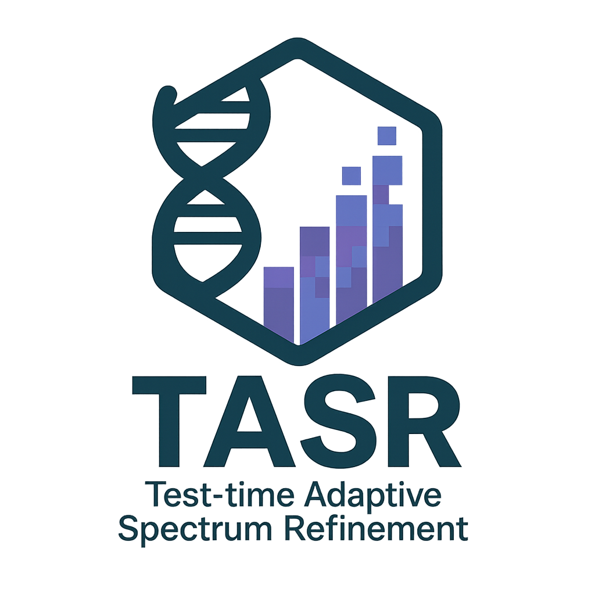

<div align="center">

# Towards Robust Hyperspectral Target Detection via Test-Time Spectrum Adaptation

**[Robin Gerster](https://github.com/RobinGerster7)<sup>1</sup>, [Peter Stütz](https://www.researchgate.net/profile/Peter-Stuetz)<sup>1</sup>**  
<sup>1</sup> University of the Bundeswehr Munich


</div>

<p align="center">
  <a href="#-update">Update</a> |
  <a href="#-overview">Overview</a> |
  <a href="#-datasets">Datasets</a> |
  <a href="#-usage">Usage</a> |
  <a href="#-citation">Citation</a> |
  <a href="#-contact">Contact</a>
</p>

<p align="center">
  
</p>

---

# 🌞 Overview

**TASR** is the first framework for **test-time domain adaptation** based on **target spectrum refinement**. It enhances hyperspectral target detection by using a discrete genetic algorithm to dynamically adapt to new environmental conditions. TASR is frugal, requiring only one labeled image containing the target material to be detected, making it highly efficient.


---

# 📖 Datasets

Traditional hyperspectral target detection relies on benchmark datasets such as **San Diego, Urban, ABU, and HYDICE**. However, these datasets are often small and evaluated on the same images used for training, leading to **overly optimistic results**.

To improve real-world robustness, we introduce **cross-scene domain adaptation benchmarks**, inspired by optical object detection setups. These benchmarks require models to extract target spectra from one scene and generalize to another, simulating real-world conditions where detectors must adapt to **new environments**.

### 📂 Dataset Downloads

| Dataset  |  Download Link   |
|:---------|:----------------:|
| SanDiego | [Google Drive](https://drive.google.com/file/d/1lWOUSpMoIRrMngmIGETXglSYEZWljSXa/view?usp=sharing) |
| Camo     | [Google Drive](https://drive.google.com/file/d/1hjpwV5U3K-E2DhaOBfgm-G82D8xC5Ias/view?usp=sharing) |
| SSD      | [Google Drive](https://drive.google.com/file/d/1riN-3BZnn19Euub7dF6qFTukmHy99F1X/view?usp=sharing) |

After downloading and extracting the ZIP files, ensure your dataset structure is as follows:

```
/datasets/
│── SanDiego1/
│── SanDiego2/
│── Camo1/
│── Camo2/
│── Shady/
│── Sunny/
│── Diffuse/

```

Each folder contains a `.mat` file.

---

# 🚀 Usage

### 1️⃣ Install Python 
We recommend **Python 3.13**. You can download it from [python.org](https://www.python.org/downloads/release/python-3100/).

### 2️⃣ Create a Virtual Environment (Recommended)
Setting up a virtual environment helps avoid dependency conflicts.

### 3️⃣ Install Dependencies

```bash
pip install -r requirements.txt
```

### ✅ Running the Demo

To quickly test your setup, run the demo script:

```bash
python demo.py
```

This script will:
- Load datasets from datasets/ with user-defined source &rarr; test folders.
- Performs a detection test using a selectable detector and target spectrum generator.
- Computes and prints evaluation metrics, including AUC scores and inference time.
- Visualize detection maps.

### 🛠 Customizing the Demo

Modify `demo.py` to:
- **Change datasets**: Update `source_folders` and `test_folders` in the `DemoConfig`.
- **Use different detectors**: Replace `detector=CEM()` with `detector=ACE()` or another detection model.
- **Disable domain adaptation**: Replace `target_spectrum_generator=TASR()` with `target_spectrum_generator=MeanGenerator()`.

For advanced modifications, edit the `DemoExperiment` class in `scripts/experiments/demo_experiment.py` or update the config in `scripts/experiments/configs/demo_config.py`.

---

# ⭐ Citation

If TASR proves useful to your work, please consider starring this repository ⭐ and citing:

```
@article{gerster2025towards,
  title={Towards Robust Hyperspectral Target Detection via Test-Time Spectrum Adaptation},
  author={Gerster, Robin and St{\"u}tz, Peter},
  journal={Remote Sensing},
  volume={17},
  number={16},
  pages={2756},
  year={2025},
  publisher={MDPI}
}
```

---

# 📬 Contact

For inquiries, please contact **Robin Gerster** at:
- **Email:** [robingerster3@gmail.com](mailto:robingerster3@gmail.com) | [robin.gerster@unibw.de](mailto:robin.gerster@unibw.de)

---


